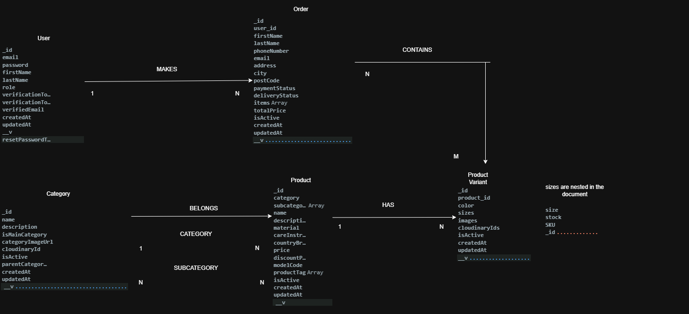
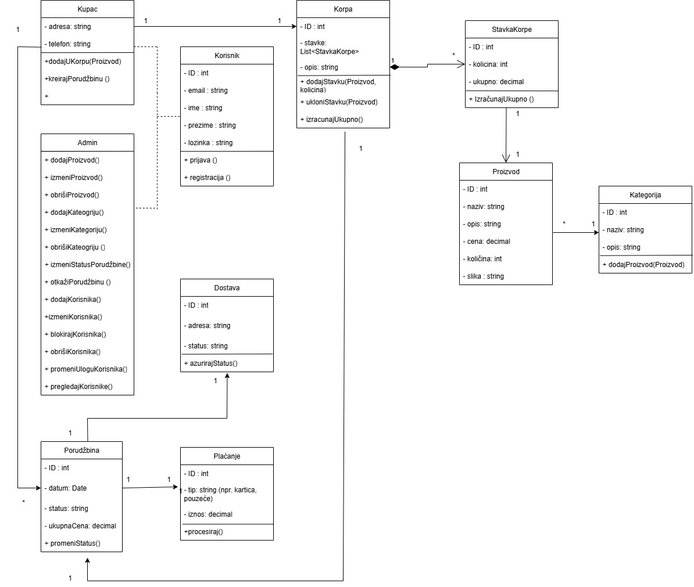
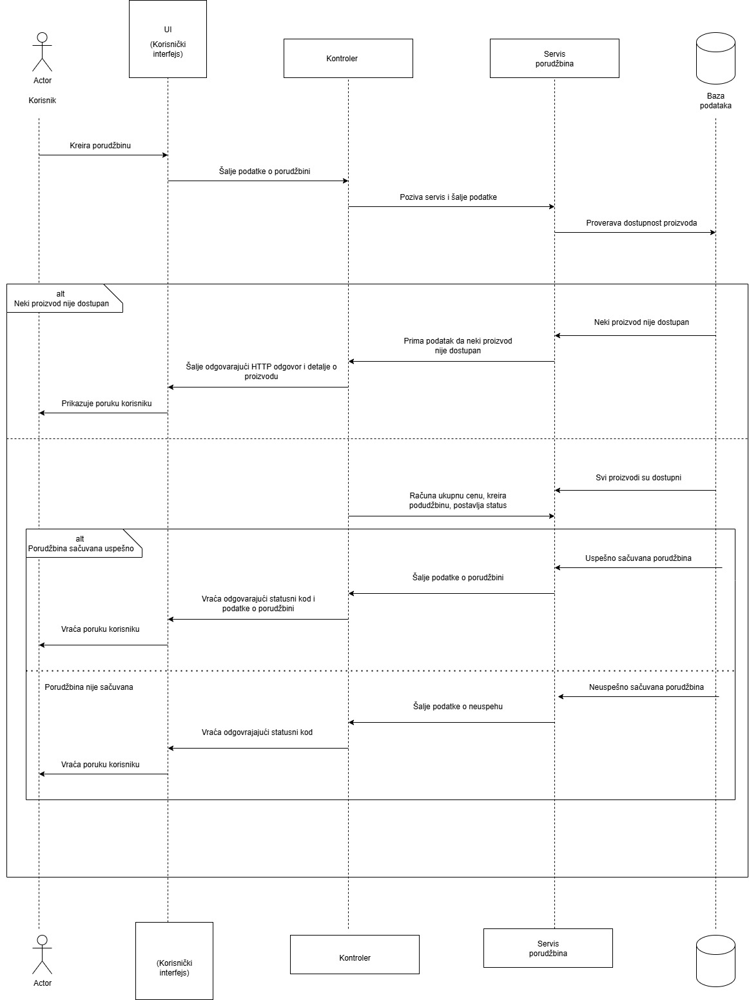
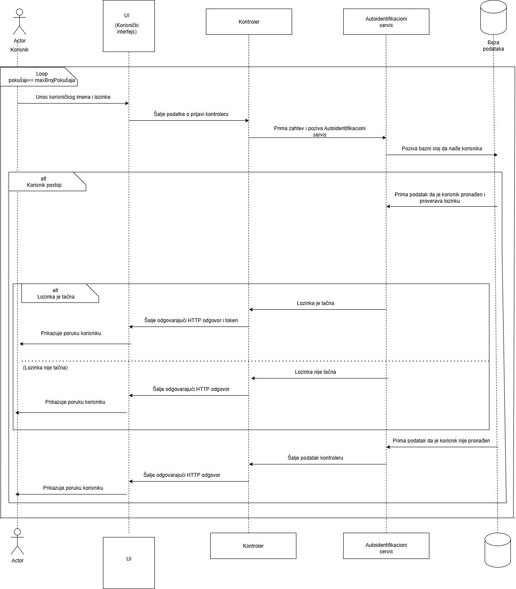

You can read basic information about the project, technologies, UML diagrams at the following link:
https://drive.google.com/drive/folders/1HfN8tC-4kowtQ_yCQM13ha0w5qVw1QSc?usp=sharing

Images are uploaded to Cloudinary with dynamic folders and transformations. For the academic project I used direct URLs, and for production I would use public_id and generate the URL via the Cloudinary SDK for scalability and flexibility.

## COLLECTIONS

## UML DIAGRAM

## Order Creating Sequence Diagram
.

## User Login Sequence Diagram
.
